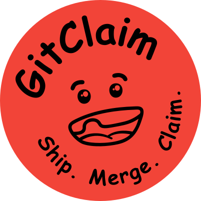

<div align="center">
  
  <h1>⚡️ GitClaim Monorepo 🚀</h1>
</div>

Welcome to **GitClaim**, your all-in-one solution for on-chain bounty payouts, AI-powered GitHub workflow automation, and futuristic web coordination - live at **[https://gitclaim.axlabs.com](https://gitclaim.axlabs.com)**!

Here’s how GitClaim **supercharges open-source collaboration:**
1. 🪙 Create & fund a bounty tied to a GitHub issue.
2. 🤖 GitClaim AI Agent recommends bounties to developers based on their skills.
3. 🔧 Developers submit PRs to fix issues and claim bounties.
4. ✅ Once merged, the GitClaim GitHub App releases funds onchain using a [vlayer WebProof](https://book.vlayer.xyz/features/web.html).

<em>No middlemen. No spreadsheets. Just seamless, verifiable rewards for real contributions.</em>

---

## 🗂️ Monorepo Structure

```bash
/gitclaim
  /app           # Next.js 15 app (NextAuth.js)
  /backend       # Node.js API server (Nest.js)
  /contracts     # Solidity smart contracts (Foundry)
  /envio-indexer # Blockchain indexer (Envio HyperIndexer)
```

---

## 💡 Tech Stack

✅ **Next.js 14** – Frontend framework <br>
✅ **NextAuth.js** – GitHub OAuth authentication <br>
✅ **shadcn-ui** – Beautiful components (dark mode by default!) <br>
✅ **Hardhat/Foundry** – Ethereum smart contract toolkit <br>
✅ **Node.js** – Backend API server (NestJS) <br>
✅ **Probot** – GitHub bot for automations <br>
✅ **pnpm workspaces** – Monorepo dependency management <br>

---

## 🌍 Live Demo

👉 Visit: **[https://gitclaim.axlabs.com](https://gitclaim.axlabs.com)**
👉 Sign in with GitHub
👉 Experience the hacker-ready dark mode!


---

## 🪙 License

MIT – do what you want, just give credit!

---

### 💬 Questions or Ideas?

Open an issue or PR – let’s build together!

---

> Let’s make onchain bounties effortless, automated, and beautiful with **GitClaim**! 💸✨
